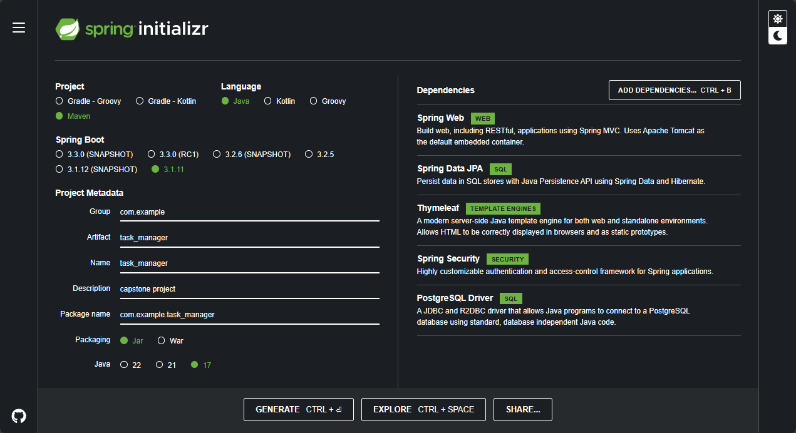
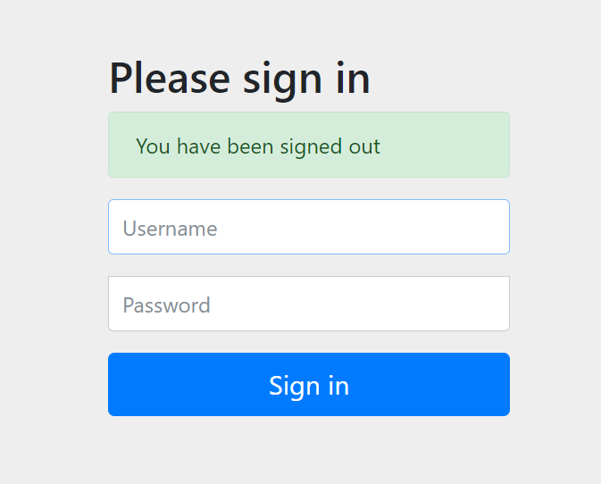

# Project Documentation: Simple Task Management System

**Group Members**: Amani Nelson, Sokheang Lim

<br>

---

## I. Installation Instructions

1. Ensure you have Java 17 or later installed on your system.

2. Install Maven using instructions from the [Official Apache Maven documentation](https://maven.apache.org/guides/getting-started/maven-in-five-minutes.html) or use the following build from the Spring Initializer.



3. Install PostgreSQL and set it up – there should be two tables created using the following commands:

```sql
CREATE TABLE Users (
    id SERIAL PRIMARY KEY,
    username VARCHAR(50) NOT NULL,
    password VARCHAR(255) NOT NULL, -- hashed password
    email VARCHAR(255) UNIQUE NOT NULL
);

CREATE TABLE Tasks (
    id SERIAL PRIMARY KEY,
    title VARCHAR(255) NOT NULL,
    description TEXT,
    status VARCHAR(50) NOT NULL,
    userId INTEGER,
    FOREIGN KEY (userId) REFERENCES Users(id)
);
```

4. Clone the repository to your local machine and open the IDE of your choice (Eclipse or IntelliJ recommended).

5. Navigate to the project directory and run `mvnw clean install` to build the project.

<br>

---

## II. Application Properties Setup

The application uses a properties file for configuration. You can find this file at `src/main/resources/application.properties`. Update this file with your specific database login details.

<br>

---

## III. Usage Guidelines

To start the application, navigate to the project directory and run `mvnw spring-boot:run`. The application will start and by default can be accessed at `http://localhost:8080`.

<br>

---

## IV. Architecture and Design Decisions

The application is built using the Spring Boot framework, which provides a robust and flexible foundation for developing Java applications. The entry point of the application is the `TaskManagerApplication` class.

The application follows a typical MVC architecture with User and Task entities, UserService and TaskService services, and controllers.

The `UserService` and `TaskService` classes in `task_manager/service/` are examples of service classes that handle business logic related to User and Task entities respectively.

The application uses Thymeleaf for server-side rendering of HTML. An example of a Thymeleaf template can be found at `src/main/resources/templates/home.html`.

<br>

---

## V. User Manual

The home page of the application provides options to manage users, manage tasks, and logout.

### a. Adding a New User

1. Click on the "Manage Users" button on the home page.

2. Click on the "Add User" button.

3. Fill in the form with the user's details and click "Submit".

<br>

### b. Adding a New Task

1. Click on the "Manage Tasks" button on the home page.

2. Click on the "Add Task" button.

3. Fill in the form with the task's details and click "Submit".

<br>

### c. Removing a User

1. Click on the "Manage Users" button on the home page.

2. Find the user you want to remove and click the "Delete" button next to their name.

3. Confirm that you want to delete the user in the popup window.

<br>

### d. Removing a Task

1. Click on the "Manage Tasks" button on the home page.

2. Find the task you want to remove and click the "Delete" button next to it.

3. Confirm that you want to delete the task in the popup window.

<br>

### e. Logging Out

1. Click on the "Logout" button on the home page.

2. You will be redirected to the login page.



<br>

---

## VI. Future Additions

The ability to update user information and task details can be added as a future addition to this project.

<br>

---

## VII. Error Handling

Errors are handled by the `error.html` page. This page provides options to return to the home page, manage tasks, manage users, or logout.